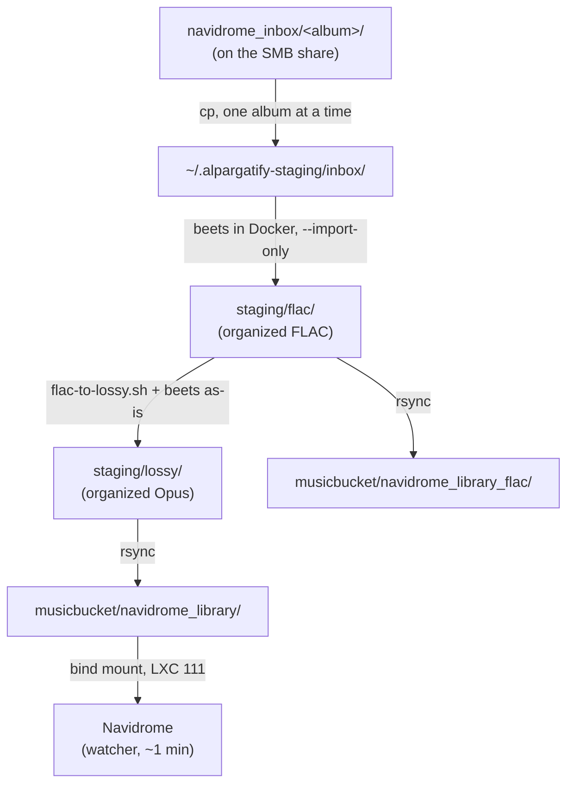

# `sync-lossless.sh`

Master entry point of the library pipeline. Takes a folder of newly acquired FLAC albums and, in one run, imports them into the **lossless** library, converts them to **Opus**, imports that into the **lossy** library that Navidrome serves, and updates the beets database of each library.

It runs **on the laptop** (macOS) against the homeserver's 5 TB HDD, exposed over **SMB** from LXC 117. The 4 TB USB SSD and Syncthing are no longer in the write path.


```mermaid
flowchart TD
    IN["navidrome_inbox/&lt;album&gt;/<br/>(on the SMB share)"] -->|"cp, one album at a time"| LOC["~/.alpargatify-staging/inbox/"]
    LOC -->|"beets in Docker, --import-only"| FLACSTG["staging/flac/<br/>(organized FLAC)"]
    FLACSTG -->|"flac-to-lossy.sh + beets as-is"| LOSSYSTG["staging/lossy/<br/>(organized Opus)"]
    FLACSTG -->|rsync| SMBFLAC["musicbucket/navidrome_library_flac/"]
    LOSSYSTG -->|rsync| SMBLOSSY["musicbucket/navidrome_library/"]
    SMBLOSSY -->|"bind mount, LXC 111"| ND["Navidrome<br/>(watcher, ~1 min)"]
```

Everything passes through a **local staging directory** that is wiped at the start of every run, so a run only ever touches the albums it is importing — the rest of the library is never re-read or re-converted.

## Requirements

| Requirement | Why | Check |
|---|---|---|
| Docker running | beets runs in a container | `docker info` |
| SMB share mounted | destinations must exist or the run aborts | `ls /Volumes/usb-hdd-wd-5tb/musicbucket` |
| `opusenc` (opus-tools) or `ffmpeg` | Opus encoding | `command -v opusenc` |
| Local free disk | staging holds one album copy + the organized FLAC/Opus of the run + two ~135 MB DBs | `df -h ~` |
| `xld` (optional) | splitting FLAC images with CUE sheets | `command -v xld` |

## Usage

```bash
cd ~/dev/workspace/alpargatify/library-organizer

# the normal run
./sync-lossless.sh -o -j 2 "/Volumes/usb-hdd-wd-5tb/musicbucket/navidrome_inbox"

# you approve each beets match yourself (needs a TTY, runs in foreground)
./sync-lossless.sh -i "/Volumes/usb-hdd-wd-5tb/musicbucket/navidrome_inbox"

# albums above 24-bit/48 kHz (otherwise they are skipped with a WARN)
./sync-lossless.sh -o -F -j 2 "/Volumes/usb-hdd-wd-5tb/musicbucket/navidrome_inbox"

# (re)build only the Opus copy of albums already in the FLAC library
./sync-lossless.sh --lossy-only missing.list -j 2

./sync-lossless.sh --help
```

`SOURCE_PATH` is the **parent** folder containing album subfolders — the script iterates `"$SOURCE_PATH"/*/`. Pointing it at a single album folder imports that album's *subfolders*, not the album.

The script can be launched from anywhere: it resolves `wrapper.sh`, `parallel-wrapper.sh` and the beets configs relative to its own location, so the same checkout works on the Mac and on the server (see [Running on the server](#running-on-the-server)).

### Parameters

| Short | Long | Meaning |
|---|---|---|
| `-i` | `--interactive` | beets prompts for each tag match. Runs **foreground and sequential** (one album at a time, ignores `-j`) and switches config to `beets/beets-config-interactive.yaml`. Needs a TTY. The Opus conversion that follows needs no input and runs as in `-o`. |
| `-o` | `--organize-only` | The working mode: import FLAC → convert to Opus → push both trees to the share → update both `library.db`. Without an organization flag the script does nothing. |
| `-f` | `--full-sync` | Alias of `-o`. It used to also mean "sync to the HDD backup"; that separate FLAC copy no longer exists. |
| `-F` | `--force-high-res` | Bypasses the quality gate (see below). |
| `-j N` | `--max-jobs N` | Albums imported in parallel. Default `nproc` (Linux) / `sysctl -n hw.ncpu` (macOS). |
| `-L LIST` | `--lossy-only LIST` | Skip the FLAC import: copy the albums listed in `LIST` (one folder per line, relative to `navidrome_library_flac`; `#` lines ignored) from the FLAC library to staging, convert them and push only the Opus side and its DB. The FLAC library is only read. Takes no `SOURCE_PATH`. Feed it the lists described in [Phase 2](#6-phase-2--lossy-conversion) or `audit-library.py --emit-missing-lossy`. |
| `-h` | `--help` | Usage. Also shown when called with no arguments. |

### Environment variables

| Variable | Default | Purpose |
|---|---|---|
| `SMB_BASE` | `/Volumes/usb-hdd-wd-5tb/musicbucket` | Moves both destinations at once — the clean way to rehearse a run against scratch dirs. |
| `SMB_LOSSLESS` | `$SMB_BASE/navidrome_library_flac` | Lossless destination. |
| `SMB_LOSSY` | `$SMB_BASE/navidrome_library` | Lossy destination (the tree Navidrome serves). |
| `STAGING_BASE` | `~/.alpargatify-staging` | Local staging root. **Wiped at the start of every run.** |
| `SMB_FAILED` | `$SMB_BASE/navidrome_inbox_failed` | Where albums that were not imported are parked instead of deleted, each with a `<album>.txt` report. |
| `FIX_OWNER` | unset | `user:group` applied (with `a+rX`) to everything written to the destinations. The server sets `0:0`. |
| `BEETS_UID` / `BEETS_GID` | `1000` | User the beets container runs as (`beets/docker-compose.yml`). The server sets `0`. |
| `ALPARGATIFY_PRUNE` | `yes` | `no` skips `parallel-wrapper.sh`'s global `docker system prune`, which on a shared Docker host would hit other stacks. |

```bash
# dry rehearsal against scratch destinations, real libraries untouched
SMB_BASE=/Volumes/usb-hdd-wd-5tb/musicbucket/.e2e-test \
  ./sync-lossless.sh -o -j 2 ~/some-local-inbox
```

### Paths and logs

| What | Where |
|---|---|
| Lossless library | `musicbucket/navidrome_library_flac/` (+ its `library.db`) |
| Lossy library | `musicbucket/navidrome_library/` (+ its `library.db`) |
| Local staging | `~/.alpargatify-staging/{inbox,flac,lossy}` |
| Per-album import log | `/tmp/import_<Album_Folder_Name>.log` |
| Conversion log | `/tmp/lossy_conv.log` |
| Albums whose Opus copy failed | `musicbucket/navidrome_inbox_failed/lossy-missing-<date>.list` |
| FLAC push log | `/tmp/push_flac.log` |

## How it works under the hood

### 1. Preflight and staging

`preflight_smb` aborts if either destination directory is missing — that is the guard against importing while the share is unmounted, which would otherwise write the library into an empty mountpoint on the local disk. Then `setup_staging` deletes and recreates `$STAGING_BASE`.

### 2. Beets DB round-trip

Each library owns its own beets database next to its content (`navidrome_library/library.db`, `navidrome_library_flac/library.db`). beets runs against the *staging* directory, so the DB has to travel:

- `fetch_db` copies the share's DB into the staging dir before the import and records a **SHA-256 fingerprint** of it. A missing DB only warns (beets starts a fresh one, without duplicate detection); a DB that fails the `SQLite format 3` header check aborts the run.
- `push_db` sends it back afterwards — lossless right after the import phase, lossy after the conversion — but **only if the fingerprint changed**. Nothing imported means no push, which matters because writes to the share run at ~2.5 MB/s and each DB is ~135 MB.
- The new DB lands as `library.db.tmp`, then two renames put it in place and keep the old one as `library.db.prev`. Renames are server-side on the share (instant), so only the new DB crosses the wire.

Paths stored inside these DBs are **relative** (`Artist/Album/track.opus`), so shuttling them between the share and staging is safe regardless of where `/data` is mounted in the container.

> A fingerprint is used rather than an mtime comparison on purpose: bash compares mtimes at one-second granularity, so a DB written in the same second as the fetch would read as untouched and its push would be skipped — the files would land on the share while the import record silently did not.

### 3. Source localisation (the Docker + SMB constraint)

Docker Desktop **cannot bind-mount a path on an SMB share**, and the beets container mounts *both* an import folder and an output folder. Attempting to import straight from the share fails with:

```
Error response from daemon: error while creating mount source path
'/host_mnt/Volumes/usb-hdd-wd-5tb/musicbucket/navidrome_inbox/<album>':
mkdir /host_mnt/Volumes/usb-hdd-wd-5tb: file exists
```

So the output side uses local staging, and `import_album()` copies each album from the share into `staging/inbox/` before importing, deleting that copy immediately after — one album at a time, so peak local disk stays at roughly one album. `is_network_path()` decides this from `df` (`//host/share` for SMB, `host:/export` for NFS) rather than hardcoding `/Volumes`, so a local inbox imports in place with no copy.

### 4. Quality gate

`check_flac_format` reads the **first** FLAC of each folder with `afinfo` (macOS) or `metaflac` (Linux, package `flac`) and returns:

| Detected | Behaviour |
|---|---|
| 16-bit / 44.1 kHz | passes silently |
| ≤ 24-bit / 48 kHz | `WARN`, proceeds |
| above that | `WARN` and **the folder is skipped** unless `-F` |
| unreadable sample rate / bit depth | `WARN`, proceeds |

Folders containing `.mp3` files are skipped outright.

### 5. Phase 1 — lossless import

For each album, `wrapper.sh --import-only <album> <staging/flac>` starts a one-shot beets container (`beets/docker-compose.yml`) with:

- `<staging/flac>` → `/data` (library root, so `directory: /data` and `library: /data/library.db`)
- the album → `/import`
- the chosen config → `/config.yaml`

`--import-only` skips conversion, so the original FLAC is imported as-is. beets uses `move: yes`, so the audio is **moved** out of the album copy into the organized tree. Each container gets a unique compose project name derived from the folder name (falling back to an md5 prefix for names with restricted characters), which is what allows several imports to run in parallel.

`entrypoint.sh` inside the container handles multi-disc albums — if a folder holds two or more `CD N` / `Disc N` subfolders it imports from the parent so they group as one album — and retries beets up to 10 times with a growing backoff, which absorbs the SQLite lock contention of parallel jobs sharing one `library.db`.

It does **not** retry once beets has already moved part of the album: a retry would import the rest as a second album, or skip it as a duplicate. And after every attempt it counts the library rows whose path is still under `/import`; if that number grew, beets died between adding the rows and moving the files, so it logs `PARTIAL IMPORT` and exits `4`. Before this guard such albums ended up as DB rows pointing to `/import/...` with their files half moved (three albums in the FLAC library, see `audit-library.py`).

`finalize_source` then decides the source folder's fate:

- wrapper exited `0` **and** no audio is left in the folder beets imported from → the source is **deleted** (`rm -rf`); the audio has been moved into the lossless library.
- anything else → the folder is **moved to `navidrome_inbox_failed/`** (timestamp suffix if the name is taken), a `WARN: Not imported: <album> — <reason>` is printed, and **`<album>.txt`** is written next to it: date, mode, exit code, a plain-language reason and, in automatic mode, the last 60 lines of the album's import log.

Folders rejected before import (`.mp3` inside, or above 24-bit/48 kHz without `-F`) take the same route instead of being left in the inbox, where every automatic run would trip over them again.

The "audio left behind" check matters because beets exits `0` when it *skips* an album: choosing Skip in interactive mode, or `duplicate_action: skip`. Before this check those albums were deleted without having been imported.

### 6. Phase 2 — lossy conversion

Then the organized FLAC in staging is fed back through `wrapper.sh --as-is`: `flac-to-lossy.sh` converts into a temp dir and beets imports that into `staging/lossy` **as-is** — `import -A -W` with `lastgenre`, `lyrics`, `musicbrainz`, `scrub` and `fromfilename` disabled (`beet -P`). The FLAC files already carry the tags beets wrote in phase 1 and `opusenc` copies them (and the embedded cover), so the Opus album gets exactly the same folder, file names and metadata as the FLAC one, with no second MusicBrainz/Last.fm/LRCLIB round and nothing to ask in interactive mode. `fetchart` stays on, but as-is imports only use local art (the `cover.*` the converter copies). Album folders containing subfolders are dispatched through `parallel-wrapper.sh` with `--max-jobs`; flat album folders go one at a time.

Before, the Opus side was autotagged again from scratch, which could pick a different release than the FLAC (three Nadja albums carry different MusicBrainz IDs in each library) or different genres.

A failed album no longer stops the batch. The conversion loop runs in a subshell that inherits `set -e`, so the first `wrapper.sh` that returned non-zero used to abort every album after it — that is how 13 Keith Jarrett albums imported together on 2026-07-06 never got an Opus copy. Now each failure is recorded (`parallel-wrapper.sh` appends the failed folder to `$FAILED_LIST_FILE`), the loop goes on, and at the end the script prints `N album(s) are in the FLAC library but have NO Opus copy`, writes them to `navidrome_inbox_failed/lossy-missing-<date>.list` (relative to the FLAC library, ready for `--lossy-only`) and exits `1`. A `.list`, not a `.txt`: `status.sh failed` reads every `*.txt` there as an album report.

Skips are detected too: beets exits `0` when it does not import an album in quiet mode (duplicate) or on Skip, without printing `Skipping.`, so `wrapper.sh` checks on the host whether audio is still in its temp dir and returns `3` if so. (Inside the container that check is unreliable on Docker Desktop for Mac: the shared folder keeps listing stale upper/lower-case variants of files beets just moved.)

The effective encode is **Opus 256 kbps**, invoked as `opusenc --bitrate 256 <in> <out>`. Override it wholesale with `ENCODE_OPTS`, which *replaces* the argument list rather than adding to it:

```bash
ENCODE_OPTS='--bitrate 192 --vbr --music' ./sync-lossless.sh -o <inbox>
```

> Note: `flac-to-lossy.sh --help` advertises the default as `--bitrate 256 --vbr --music`, but `DEFAULT_OPUS_ARGS` is only ever interpolated into that help text — the real `ENCODE_ARGS` is just `--bitrate`. `opusenc` is VBR by default so the audible result is close, but the help text does not match the code.

AAC via `afconvert` (macOS only) and CUE-image splitting via `xld` exist in the converter but are not reachable from `sync-lossless.sh`, which never passes `--format` or `--split-only`.

### 7. Pushes to the share

- Organized FLAC → `SMB_LOSSLESS` starts **in the background**, in parallel with the conversion, since it is the slowest step.
- Organized Opus → `SMB_LOSSY` runs after the conversion finishes.
- Both use `rsync -a --exclude='library.db' --exclude='beets-config.yaml'`; the DBs are handled separately by `push_db` so a half-written DB is never visible on the share.

Navidrome (LXC 111) bind-mounts `navidrome_library` and its watcher (`WatcherWait = "1m"`) picks the new folders up on its own — a verified run logged `Scanner: Finished scanning selected folders  numTargets=4` about a minute after the push, with no manual scan.

### 8. Cleanup

`$STAGING_BASE` is removed at the end of every completed run, including one where some Opus copies failed (their list is already saved in `navidrome_inbox_failed/`). It is *not* removed when the run aborts, which is deliberate: the staged albums and DBs are still there to inspect.

## Resulting library layout

From the beets path template:

```
T. Rex/
  T. Rex - [1971] Electric Warrior/
    01. T. Rex - Mambo Sun.opus
  T. Rex - [1995][Compilation] The Essential Collection/
    01. T. Rex - 20th Century Boy.opus
```

`$formatted_albumartist` is an inline-plugin field that transliterates the artist name; `$atypes` adds `[Compilation]`, `[EP]`, `[Live]` and friends; `%aunique{}` appends a disambiguator such as `[5065]` when two different albums would otherwise collide. Multi-disc releases get a `Disc N/` level and `N-NN.` track prefixes.

## Failure modes

The pipeline is per album: one album failing never stops the others, and a failed or skipped album is moved, untouched, to `navidrome_inbox_failed/`.

| Symptom | Cause | What to do |
|---|---|---|
| `SMB destination(s) not reachable` | share not mounted | mount it; nothing has run yet |
| `mkdir /host_mnt/Volumes/...: file exists` | Docker asked to mount an SMB path | should not happen anymore; means localisation was bypassed |
| `Failed to organize <album>` + container log ends in `Skipping.` / `exited with code 2` | beets found no confident match in quiet mode | album is in `navidrome_inbox_failed/`; rerun it with `-i` and judge the match yourself |
| `beets did not import <album> (skipped / duplicate / no match)` | exit 0 but audio left behind: interactive Skip or duplicate | album is in `navidrome_inbox_failed/`; delete it if it really is a duplicate |
| `File exceeds 24-bit/48kHz` then `Skipping folder` | quality gate | rerun with `-F` if you want it anyway |
| `Beets DB unchanged this run — skipping push` | nothing was imported | expected, not an error |
| `Staged beets DB ... looks corrupt — NOT pushing` | staged DB failed the header check | share DB is intact; investigate staging before rerunning |
| `Beets import completed with some skippings` | exit code 2 from the container | partial success; check the per-album log |
| `PARTIAL IMPORT` in the album log, exit `4` | beets died after adding DB rows but before moving every file | album is in `navidrome_inbox_failed/`; run `audit-library.py`, fix the rows pointing to `/import`, then retry |
| `N album(s) are in the FLAC library but have NO Opus copy` | an Opus conversion or as-is import failed or was skipped (duplicate) | the FLAC is fine; rerun the printed `--lossy-only <list>` (on the server: `server/sync.sh lossy <list>`) once the cause is fixed |
| `Beets left the files in place` (exit `3`) | beets exited 0 without importing: duplicate or Skip | for the Opus side, the album already exists there (maybe under another folder) |

Exit codes: `0` all albums imported; `2` at least one skipped (no confident match in quiet mode); `3` (`wrapper.sh`) files left in place — duplicate or Skip; `4` partial import, DB rows left under `/import`; anything else a real failure. `sync-lossless.sh` itself exits `1` when some album still lacks its Opus copy.

Rollback material after a bad run: `library.db.prev` next to each library, and for Navidrome itself the DB copy at `/root/pre-musicbucket-backup/navidrome.db` on the PVE host.

## Operational notes

- **Keep the share in NFC.** macOS writes NFC over SMB, but `rsync` from an APFS disk writes NFD, which produces duplicate accented artist folders (`Björk` twice) and changes the paths Navidrome has indexed — with `PurgeMissing = "always"` that costs play counts and stars. `/root/nfc-normalize.py` on the PVE host fixes a tree (`--apply` to execute).
- **Permissions.** Samba writes as uid/gid `100000` with `create mask = 0664` / `directory mask = 0775`, which the non-root `navidrome` user can read. Content arriving by other means (a host-side `rsync`) can land `0660`/`0600` and be invisible to Navidrome; fix with `chown -R 100000:100000` + `chmod -R a+rX`.
- **The share is slow.** Measured: **2.5 MB/s write, 5.6 MB/s read** over wired Ethernet, against a disk that does 46 MB/s locally — the bottleneck is the SMB path, not the HDD. Most of a run's wall-clock is transfer, which is why no-op DB pushes are skipped and why the FLAC push overlaps the conversion.
- **`-j` above 2 buys little.** The network is the limit, and all parallel jobs share one SQLite `library.db`; the container's retry loop hides the contention but does not remove it.
- **`duplicate_action: skip`.** beets cannot delete a duplicate's existing files — the real library is never mounted into the container — so `remove` would drop the DB row and leave the files, letting the re-import land beside the original under a `%aunique{}` suffix. `skip` keeps what is already there.
- **Successful imports consume the inbox folder.** If you want to keep a copy, copy it aside first.

## Running on the server

The same script runs on LXC 101 (Docker host, `10.1.1.101`), which bind-mounts the 5TB disk directly, so there is no SMB slowness and no source localisation:

| Host path | LXC 101 path |
|---|---|
| `/mnt/usb-hdd-wd-5tb/musicbucket` | `/mnt/musicbucket` |
| `/mnt/usb-hdd-wd-5tb/downloads` | `/mnt/downloads` |

The checkout lives at `/opt/alpargatify`; packages needed in the LXC: `docker.io` (already there), `tmux rsync flac opus-tools`. `sync-lossless.sh` checks for `docker`, `rsync` and `opusenc` before importing anything. Do not call `sync-lossless.sh` directly there; use the launchers in `server/`, which set `SMB_BASE=/mnt/musicbucket`, `FIX_OWNER=0:0` (= `100000:100000` on the host, what Samba and Navidrome expect), `BEETS_UID/GID=0` and `ALPARGATIFY_PRUNE=no`:

```bash
server/inbox.sh list                 # download folders with FLAC (slskd/…, torrents/…)
server/inbox.sh move "slskd/<album>" # slskd: moved; torrents: copied so they keep seeding
server/sync.sh auto                  # detached tmux session "alp-sync", log in /var/log/alpargatify/
server/sync.sh interactive           # tmux "alp-sync-i"; run it again to re-attach after a disconnect
server/status.sh                     # phase, albums done/total, elapsed, inbox/failed counts, log tail
server/status.sh failed              # failed albums and why
server/inbox.sh list failed          # failed albums; `move "failed/<album>"` puts one back in the inbox
server/sync.sh lossy /root/missing.list   # rebuild the Opus copy of the FLAC albums listed (tmux "alp-sync")
server/audit.sh                      # read-only health check of both libraries (see below)
```

Only one sync runs at a time (both modes share the staging dir). From the phone, the iOS shortcuts in `shortcuts/ios/` call these over SSH through Tailscale; interactive mode needs a real terminal, so use an SSH app (Termius, Blink) and run `server/sync.sh interactive`.

## Auditing the libraries

`audit-library.py` is a read-only health check: it compares each library's beets DB with the files on disk and the two libraries with each other. It never writes to them (DBs are opened read-only).

```bash
# on the server (authoritative: compares names byte for byte, as Linux and Navidrome see them)
server/audit.sh                                   # summary, 10 samples per finding
server/audit.sh --list                            # every entry
server/audit.sh --emit-missing-lossy /root/missing.list && server/sync.sh lossy /root/missing.list

# from the Mac, over SMB (slower; the NFC/NFD finding is NOT reliable there: macOS shows many NFC names as NFD)
./audit-library.py --lossless /Volumes/usb-hdd-wd-5tb/musicbucket/navidrome_library_flac \
                   --lossy /Volumes/usb-hdd-wd-5tb/musicbucket/navidrome_library \
                   [--old /Volumes/usb-hdd-wd-5tb/music]
```

`[!!]` findings are problems (exit status `1`), `[--]` lines are informational:

| Finding | Meaning |
|---|---|
| DB path differs only in Unicode normalization / letter case | the file is there under a slightly different name: the DB row was stored in another normalization (NFD), or two `albumartist` spellings were merged into one folder on the case-insensitive SMB side. beets on Linux sees these items as missing, so a `beet update` would drop them. Only trust the normalization count when run on the server. |
| DB items with no file / absolute path outside the library | rows pointing to nothing, or to `/import/...` (broken import) |
| audio files not in the DB | files beets does not know about |
| album rows without items / releases imported more than once / art path missing | DB debris and duplicates |
| album folders only in FLAC / only in Opus / whose tracks differ, DB albums only in one side, tags that differ | the mirror is broken |
| files modified >1 day after beets last wrote them | tags edited outside beets; `beet update -p` shows what the DB would pick up |
| folders without audio, temporary/partial files, other non-music files | leftovers to clean |

`--emit-missing-lossy FILE` writes the FLAC album folders that have no Opus folder at all; albums that would fail or duplicate are written commented out with the reason (`# not (fully) in the FLAC DB, fix first: …`). `--old DIR` checks that an old copy of the Opus library holds nothing the current one lacks (`SAFE TO DELETE`).

## Related files

| File | Role |
|---|---|
| `wrapper.sh` | single-album orchestrator: converter + beets container |
| `parallel-wrapper.sh` | runs `wrapper.sh` per subdirectory in parallel |
| `flac-to-lossy.sh` | conversion engine (Opus/AAC, CUE splitting) |
| `beets/docker-compose.yml` | container definition and volume mapping |
| `beets/entrypoint.sh` | per-album loop, multi-disc detection, retries |
| `beets/beets-config.yaml` | quiet/non-interactive beets config |
| `beets/beets-config-interactive.yaml` | config used by `-i` |
| `audit-library.py` / `server/audit.sh` | read-only audit of both libraries and their DBs |
| `homeserver` repo: `docs/storage.md` | server side: `musicbucket/` layout, bind mounts, NFC and permission rules |
